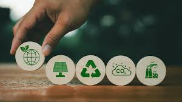

[Volver al índice general](sostenibilidad/README.md)

"La sostenibilidad es un concepto que busca satisfacer las necesidades del presente sin comprometer la capacidad de las generaciones futuras para satisfacer las suyas"

